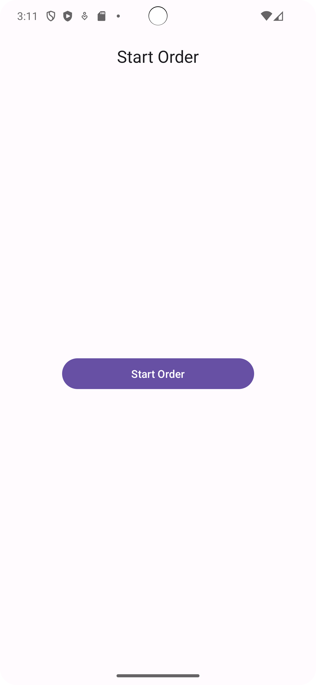
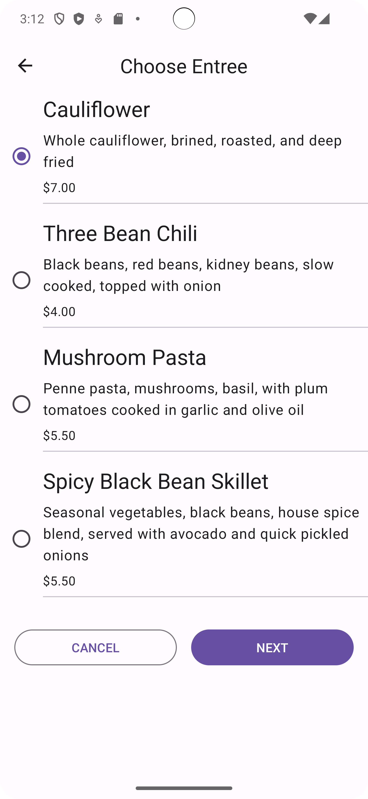
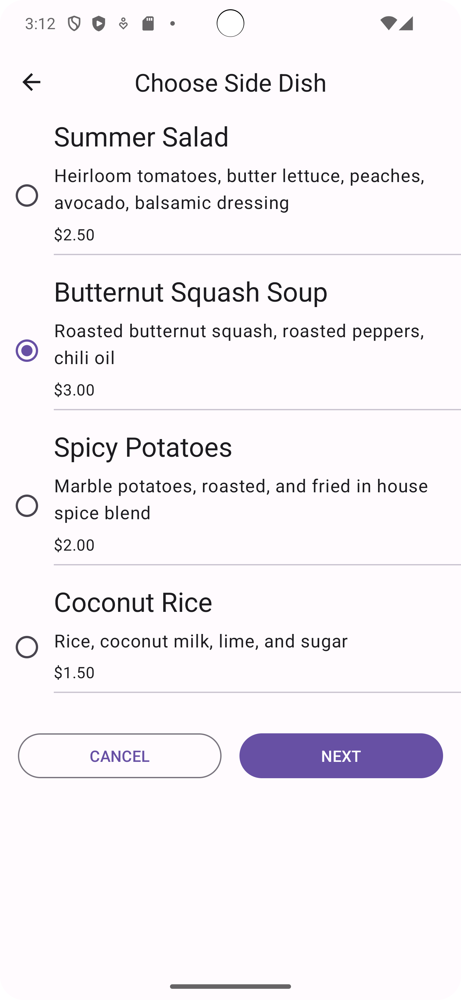
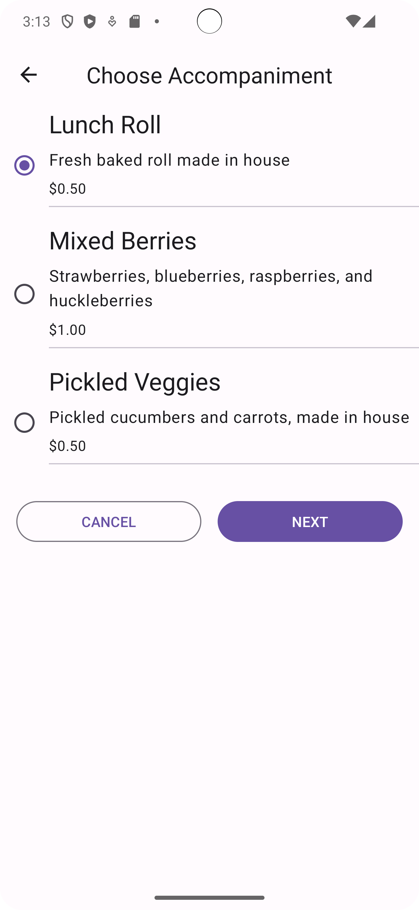
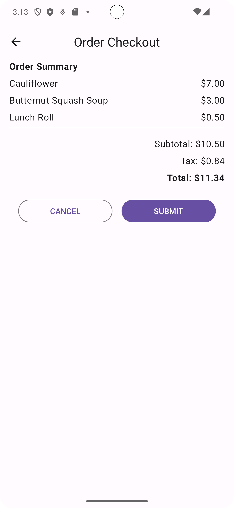

Lunch Tray App
==================================

The Lunch Tray app is an interactive lunch ordering app with three screens. Each screen represents one of the three types of menu items from which you can select: an entree, a side dish, and an accompaniment.
It's developed using Jetpack Compose components like ```Column```, ```Button```, ```Text```, ```Image```, and ```Modifier```.

<p align="center">
  
  
  
  
  
</p>

Getting Started
---------------
1. Install Android Studio, if you don't already have it.
2. Download the sample.
3. Import the sample into Android Studio.
4. Build and run the sample.
